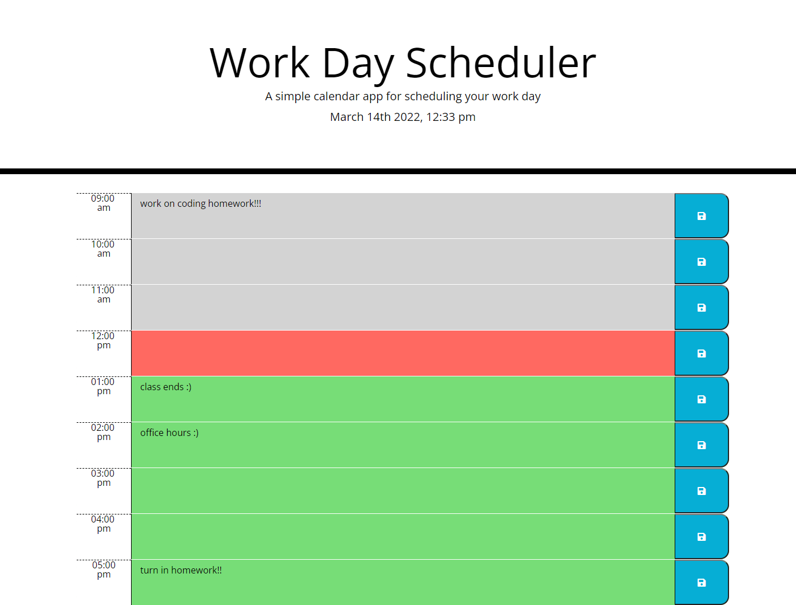

# # Work Day Scheduler

Created a simple calendar application that allows the user to save events for each hour of the work day by modifying the starter code provided.
## Screenshots

## Objectives
Main Objective: Th user can save events for each hour of the work day and the schedule changes color as the time goes by.

- The current date and time is displayed at the top of the page
- There are timeblocks for standard business hours
- Each timeblock is color coded to indicate whether it is in the past, present, or future
- When the user clicks into a timeblock they are able to enter an event
- When the user clicks the save button for that timeblock then the text for that event is saved in local storage
- When the page is refreshed the saved events still appear on the schedule
## Link

[Link to finshed webpage](https://emily-mvaz.github.io/work-day-scheduler/)

## Contributions
I used the [jQuery api](https://api.jquery.com/), [Moment.js](https://momentjs.com/), [Bootstrap documentation](https://getbootstrap.com/docs/5.0/getting-started/introduction/), as well as [W3Schools](https://www.w3schools.com/jquery/default.asp) to reference back to and help me while writing my code.

My tutor, Jose Lopez, also helped me go over some concepts and looked over my code to ensure it worked properly adn I understood it.
## License

[MIT](https://choosealicense.com/licenses/mit/)

